<h1 align="center">AIPCC — AI-Powered Cybersecurity Co-Pilot</h1>

<p align="center">
Ingest a security log. Get a structured, cited, validated incident report — and a number for how much of it you can trust.
</p>

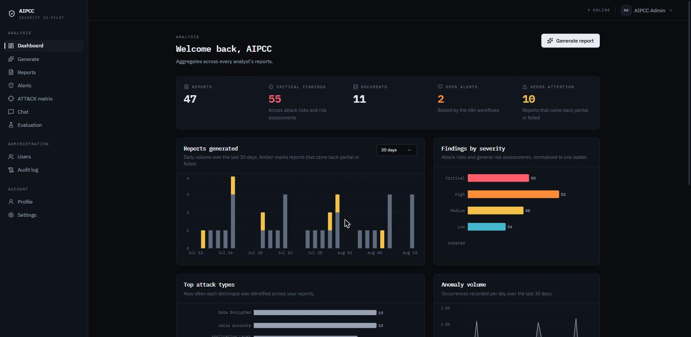
*A fresh `docker compose up` with the demo seed: 47 reports, 55 critical findings, and — the tile that matters — **10 needs attention**, reports that came back partial or failed. Nothing here is a placeholder; every figure is a SQL `GROUP BY` over real rows, and a failed aggregate renders as `—` rather than `0`, because "I could not read this" and "there are none" are the one pair of states a security dashboard must never confuse.*

AIPCC takes a security log (CSV / JSON / TXT / LOG), embeds it into a vector
store, and generates a five-section incident report — **attack types** (MITRE
ATT&CK-mapped), **risk assessment**, **vulnerabilities** (CVE/CWE), **anomalies**
and an **event timeline**. The five sections are written concurrently, validated
against one canonical Pydantic schema, and repaired once if validation fails.
Every finding cites the log rows it came from, and citations the model invented
are detected and marked rather than quietly dropped.

Around that sit the things a report generator needs before anyone would use it:
a MITRE ATT&CK matrix that shows what was detected *and* what the model got
wrong, an attack graph built from stored rows rather than a second LLM pass,
PDF/DOCX export, revocable share links, an append-only audit log, per-call token
and cost accounting, and n8n workflows for scheduling and third-party
enrichment.

**Rebuilt from a university group prototype.** The original
([`ahmed2bassam/AIPCC`](https://github.com/ahmed2bassam/AIPCC), 7 contributors,
dormant since March 2026) proved that RAG-over-logs plus a structured report was
a real idea. It was also structurally broken: it dropped and recreated its
database on every boot, hardcoded `current_user`, stored plaintext passwords,
stacked every page in `App.jsx` with no router, and its report-writing prompt and
its storage layer disagreed about field names so rows saved mostly null. **This
repo is a ground-up reimplementation.** The RAG pipeline and the five section
prompts were ported; everything else was rewritten. The specific defects and
what happened to each are in [`PORTING.md`](PORTING.md), and the six that must
never come back are enforced by tests, not by convention —
`tests/test_foundation.py::TestHardRules`.

---

## Headline numbers

Measured **2026-08-10** by `python -m app.eval.run --live` against
`gemini-2.5-flash`, on a 35-row hand-labelled golden log, scored against the
real published MITRE catalogues (ATT&CK Enterprise v17.1, 823 techniques; CWE
v4.20, 969 weaknesses) vendored and checksummed in-repo:

| Metric | Live (`gemini-2.5-flash`) | What it means |
|---|---|---|
| **Hallucination rate** | **0.0%** (0/6 identifiers) | No invented ATT&CK/CWE id, and no real id under a name that is not its own |
| **Grounding rate** | **100%** (23/23 findings) | Every finding cites content the model was actually shown |
| **Fabricated citations** | **0** | No claim to have read a log chunk it was never given |
| Recall — coverage | 100% | Every labelled event appears somewhere in the report |
| Recall — distinct | 55.6% | Only 5 of 9 got a finding of their own; the rest were bundled into narratives |
| Precision | 100% | Nothing labelled benign was reported as an attack |
| Cost | $0.078, 45,096 tokens, 32.7 s | One full report, five sections |

The **55.6%** is the interesting one, and it is not a bug. Three attack findings
covered seven labels because one of them was a campaign narrative that mentioned
PowerShell, the SMB sweep, the beacon and the log clearing in passing. That is
defensible analysis — but scoring it as seven separate findings would be
flattering, so both numbers are reported and the gap between them is the signal.

**Scope — read this before the numbers.** These figures describe **one synthetic
35-row CSV with a deliberately unambiguous story**, run once. They say nothing
about noisy production data, about log formats other than CSV, or about attacks
not represented in that file. **Retrieval quality is not evaluated at all** —
golden retrieval is a fixed selection over five chunks, so a change that made the
retriever pick worse chunks would not move any number above. The harness measures
whether the model *fabricates* and whether it *cites*; it does not measure whether
the system would find a real intrusion in a real SIEM export. All of this is
stated at length in [`backend/EVAL.md`](backend/EVAL.md) under *What it does not
prove*, and none of it is implied away here.

The CI quality gate is a **separate** measurement on a deliberately weak recorded
model, and it exists to catch validator regressions rather than to describe model
quality. See [Evaluation](#evaluation) — it is worth reading before quoting any
number from it.

---

## Quickstart

```bash
git clone https://github.com/Zaidzyy/AIPCC && cd AIPCC
cp .env.example .env
docker compose up
```

Then open **http://localhost:5173** and sign in with **`admin@aipcc.io` / `admin`**.

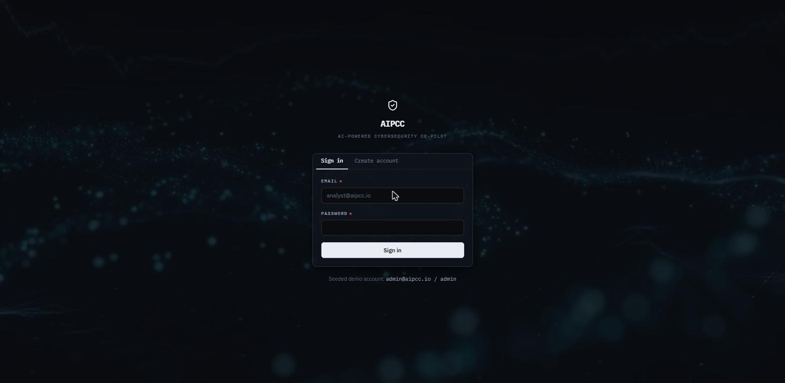
*The credentials are on the page, because a reviewer who reaches a login form with no way in has been handed an app that is running and unusable.*

`.env.example` boots the stack unedited — every value has a working local
default, and **no LLM API key is needed** to browse: the demo seed creates six
weeks of reports without calling a model. Add a `GEMINI_API_KEY` only when you
want to generate a *new* report.

<details>
<summary>What happens on that first <code>docker compose up</code>, and why it is not hard-rule #1</summary>

The backend container runs `alembic upgrade head`, then
`seed --demo --ingest`, then binds uvicorn. Both steps are idempotent and print
"already present" on every boot after the first.

Seeding on boot is a deliberate exception, not a lapse. Hard rule #1 forbids
schema creation from application code — that still only ever happens through
Alembic. The alternative to seeding is a reviewer running one command, reaching
a login form, and having no credentials: an app that is running and unusable.

`--ingest` had to *become* idempotent to allow it. As a hand-run script it
re-embedded unconditionally, which on a startup command meant another full copy
of the same chunks per restart — quietly degrading retrieval for as long as
nobody looked. The guard asks Chroma `count_chunks(document_id)` rather than
inferring from "did we just create the row", because Postgres and Chroma are
separate volumes and go out of step: a wiped vector store with the database
intact must still re-embed.

The embedding model (MiniLM, ~90 MB) is baked into the backend image. Otherwise
the first ingest downloads it from Hugging Face *after* the build, so the
"one command" keeps a network dependency and fails behind a rate limit with a
stack trace instead of a report. That is most of why the backend image is
**3.35 GB**; the frontend image is 690 MB.

</details>

<details>
<summary>Running it without Docker, and the other commands</summary>

```bash
docker compose up postgres -d      # just the DB, run the backend on the host
docker compose exec backend pytest # the suite, with no local Python
docker compose --profile tracing up   # + Jaeger at localhost:16686

# Backend
cd backend
alembic upgrade head
uvicorn app.main:app --reload
python -m app.db.seed --demo --ingest   # demo reports + embed the sample CSV
python -m app.db.seed --service-token   # an API key for n8n (printed once)
python -m app.db.prune                  # drop aged rate-limit rows
pytest && ruff check app tests

# Evaluation — see backend/EVAL.md
python -m app.eval.run          # replay the recorded fixtures
python -m app.eval.run --gate   # ...and exit non-zero on a regression (CI runs this)
python -m app.eval.run --live   # call the configured provider for real
python -m app.eval.vendor       # refresh the vendored ATT&CK and CWE catalogues

# Frontend
cd frontend && npm ci && npm run dev
npm test && npm run lint && npm run build
```

Without `--ingest` the sample document is registered but has no chunks, and
generation fails with *"no indexed content for document …"*. `--demo` also
creates `analyst@aipcc.io` / `analyst`, whose smaller numbers on the same
dashboard are the ownership scoping working.

</details>

---

## Architecture

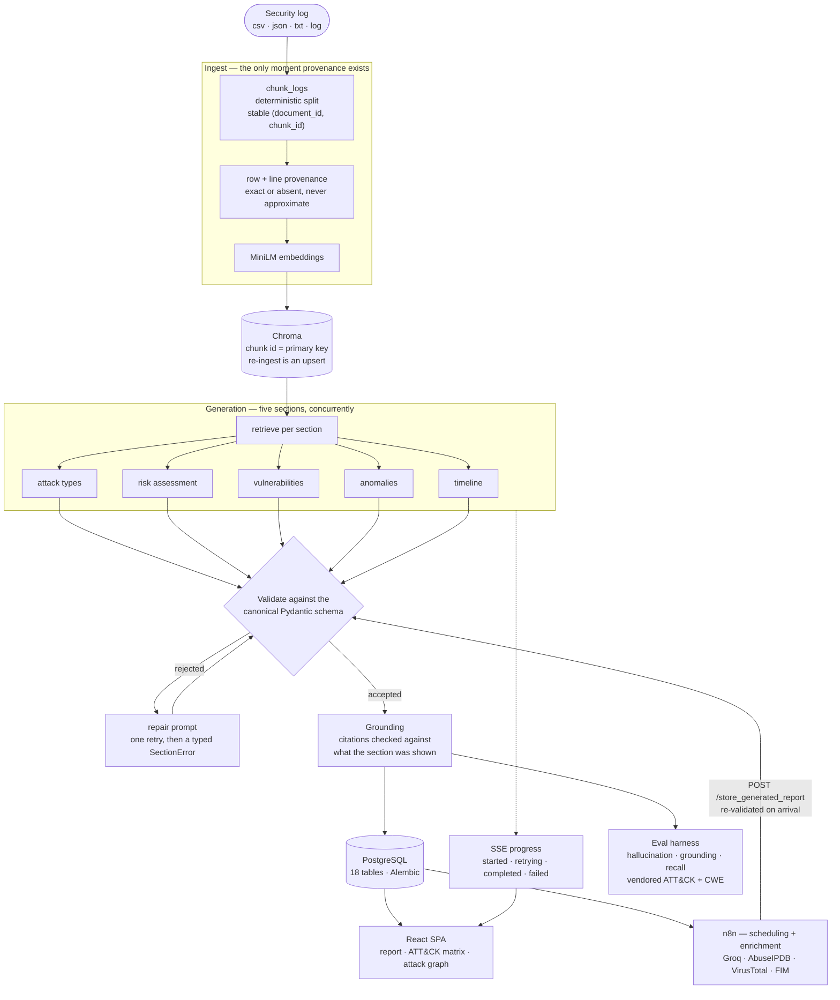

The non-obvious part is the arrow from **n8n back into Validate**. The n8n
Orchestrator duplicates the Python generator, and they are not peers: **the
Python generator is authoritative.** It owns the canonical schema, the repair
retry and the section-error contract. n8n is a *client* of that schema — it
produces sections and hands them to `/store_generated_report`, which validates
them exactly as the in-app path does before anything reaches a table. n8n owns
scheduling and third-party enrichment: questions about *when* and *from where*,
never about *what is true*. A workflow can be edited by anyone with n8n access;
the invariants cannot be edited from there at all.

---

## Report generation

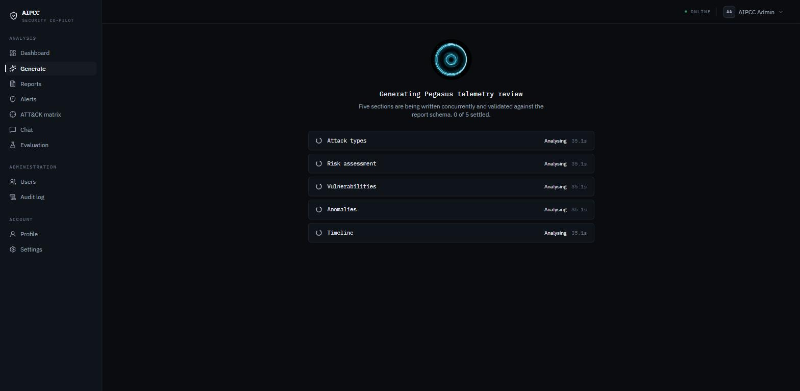
*All five sections listed as pending from the opening frame and running concurrently — each with **its own** timer, because a clock shared between five concurrent calls would describe none of them. The list does not grow as results land; a list that did would reflow on every event and hide how much is still outstanding.*

Generation streams over SSE, and the events are ordered: `started` once, then
per-section frames, then exactly one `stored`. A client that has seen `stored`
knows the report is written.

**The work does not live in the response body.** The likeliest failure of a
two-minute stream is that the client goes away — a sleeping laptop, a closed
tab, a proxy timeout — and if generation were driven by the response generator,
Starlette closing it would abandon a report mid-write. So generation *and its
storage* run in a separate task with its own session, and the response only
forwards what that task publishes. The report row is reserved in `generating`
status **before the first byte**, and its id goes out in the opening frame; a
dropped connection reconnects through `GET /reports/{id}/status` and **never
restarts generation**, which would pay for the same report twice.

<details>
<summary>Validation, the repair retry, and what a failing section actually does</summary>

**One schema, not two.** The canonical Pydantic models in
`app/schemas/report.py` have field names identical to the ORM column names, so
storage is `Model(**item.storage_dump())` with no mapping step that can drift.
This is enforced, not trusted: `tests/test_report.py::TestSchemaAlignment` fails
the build if a schema field stops matching a database column, and separately
fails if any storage code names a field as a string literal. That drift was the
prototype's single worst bug — its prompt nested risk fields under
`risk_assessment` while the table stored them flat, so reports saved mostly null
— and there is a test named
`test_nested_risk_assessment_is_not_reintroduced` whose only job is to keep it
dead.

**The prompt's JSON skeleton is generated from the Pydantic models**, so
renaming a field updates the prompt automatically rather than leaving the model
answering in last month's shape.

**A section that fails twice returns a typed `SectionError`**, and the report is
stored with status `partial` or `failed` — one bad section no longer sinks the
whole report. The error carries the *stage*, which is what separates a provider
outage from a model that will not produce valid JSON; the UI shows the two
differently. Provider failures are not retried at all: re-prompting cannot fix a
rejected API key.

**The all-null skeleton is rejected.** A model handed a JSON template will
sometimes hand it straight back with every field null. That is not a report with
no findings, it is a non-answer, and it is caught rather than stored.

**`retrying` is the point of the feature, not a leak.** A section failing
validation and coming back on the repair prompt is the system demonstrating the
robustness it claims, and a spinner hides it completely. The frame carries the
attempt number and the verbatim reason the first attempt was rejected — on a
weaker local model that reads *"Retrying — repair prompt · First attempt
rejected — validation: every item was empty; the all-null template was returned
instead of findings from the log data"*.

</details>

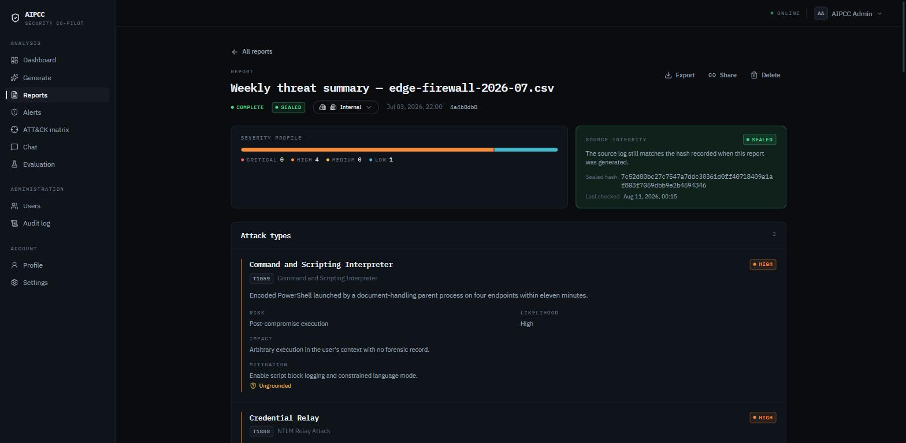
*A stored report. Note three things the UI refuses to smooth over: **SOURCE INTEGRITY — SEALED** with the SHA-256 recorded at generation time and when it was last verified; the amber **Ungrounded** marker on a finding that cited nothing; and the next finding below carrying `T1888`, an identifier that does not exist in ATT&CK. Neither is hidden — see [the ATT&CK matrix](#mitre-attck-matrix).*

---

## Evidence grounding

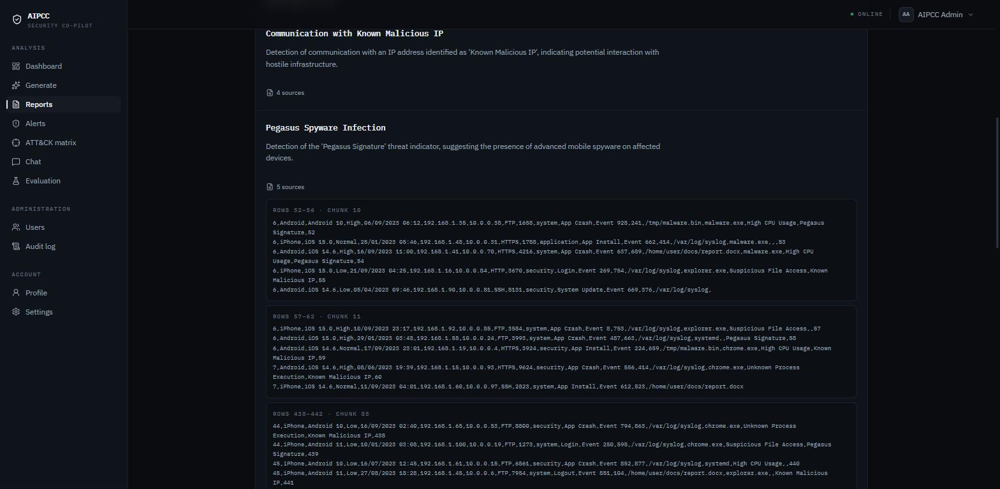
*The same disclosure a reviewer would want: this finding cites chunks 10, 11 and 85, and each one shows **the exact source rows** — `ROWS 52–56 · CHUNK 10` — with the raw log lines underneath. The row span is recorded at ingest, because that is the only moment it exists.*

A finding is only as good as what it can point at. Every section's output is
checked against the chunks that section was **actually shown**, and the result is
recorded per finding.

- **Validity is judged against what was retrieved, not merely against the
  document.** A chunk that exists but was never retrieved for that section is
  still a fabrication — the model cannot have read it. The two are counted
  separately (`unknown_citations`, `unseen_citations`) because they are
  different failures.
- **An ungrounded finding is flagged, never dropped.** Dropping it would make
  the report look cleaner than the model's actual output, and would make the
  grounding rate unmeasurable, since the ungrounded findings would no longer
  exist to count.
- **Row provenance is exact or absent, never approximate.** The row mapping
  assumes `to_csv` writes one physical line per row, which is false when a field
  contains a newline. That assumption is *checked* against the row count, and
  when it fails, row provenance is omitted for that document and logged. A
  citation pointing at the wrong log rows is worse than one that admits it
  cannot point at any — a wrong one is only ever discovered by someone checking
  it, which is the thing citations exist to avoid.
- **The public share view gets no evidence at all.** A share link grants read of
  a *report*; shipping the raw log excerpts with it would hand the holder more of
  the source data than the report itself contains.

<details>
<summary>Chunk identity, and the re-ingest bug it fixed</summary>

`(document_id, chunk_id)` is the citation key, and it is now Chroma's id too.
The pair was already stable — the splitter is deterministic, so the same bytes
produce the same chunk at the same index — but Chroma's own id was random, so
re-ingesting a file *appended* a second copy of every chunk rather than
replacing it. Making the key the id turns re-ingest into an upsert and turns a
citation lookup into a primary-key read instead of a metadata scan. Verified:
re-ingesting the sample CSV leaves **195 chunks**, not 390.

The model cites integers, not composite keys. "chunk 7" is something a language
model gets right; a UUID pair is something it invents. The document is implied
by which report is being generated, so nothing is lost.

Coercion of the model's citation field is deliberately permissive and
validation is not. Models write `[0, 3]`, `["0","3"]`, `"0, 3"`, `"chunk 3"`,
`3` and `[{"chunk_id": 2}]` for the same thing; failing a whole section over
punctuation would be absurd when the next step checks the number anyway. What
coercion never does is invent — a string with no digits yields no citation
rather than a reference to chunk 0.

</details>

---

## Evaluation

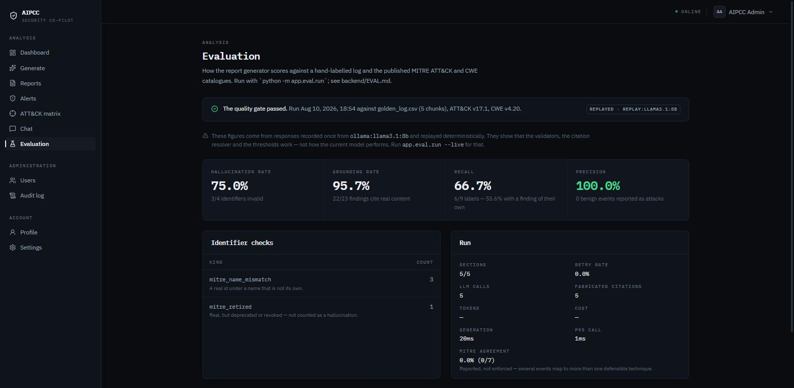
*The in-app view of the committed run. The `REPLAYED · REPLAY:LLAMA3.1:8B` badge and the amber line beneath it are load-bearing: **these numbers describe the harness, not a model.** The page says so before it shows a single figure, for the same reason this section does.*

Most "AI-powered" projects cannot answer *how do you know the output is any
good?* This one measures it against real published reference data and fails the
build when it regresses.

**The live figures are in [Headline numbers](#headline-numbers) above: 0.0%
hallucination, 100% grounding, on `gemini-2.5-flash`.** Everything below is
about the CI gate, which measures something different and must not be confused
with it.

### The CI gate replays a deliberately weak model

`python -m app.eval.run --gate` runs on every push with **no database, no vector
store, no embedding model, no network and no API key**. It chunks the committed
golden log with the same `chunk_logs` the real ingest uses and replays provider
responses recorded once from a real model.

**The committed cassette is `llama3.1:8b`, and it is bad on purpose.** It
fabricated three ATT&CK technique names and cited five chunks it was never
given. Its scores — 75.0% hallucination, 95.7% grounding, 5 fabricated citations
— are therefore **not a claim about this system's output quality**. They are a
frozen input to a regression test on the *validators*: the gate passes only if
all four known identifier defects are still caught.

A cassette of clean output would prove much less. On a frozen recording, a
validator that silently stopped working would send the hallucination rate to
**zero** and sail through every upper bound — the regression would look like an
improvement. That is what `EVAL_MIN_DETECTED_ISSUES=4` is for, and it is the
threshold that makes the other three mean anything.

| | Replayed (what CI enforces) | Live (what the system does) |
|---|---|---|
| Recorded from | `ollama:llama3.1:8b` | `gemini-2.5-flash` |
| Purpose | validator regression harness | model measurement |
| Hallucination rate | 75.0% (3/4) | **0.0%** (0/6) |
| Grounding rate | 95.7% (22/23) | **100%** (23/23) |
| Fabricated citations | 5 (17.9%) | **0** |
| Recall (coverage / distinct) | 66.7% / 55.6% | 100% / 55.6% |
| Precision | 100% | 100% |
| Section success | 5/5 | 5/5 |
| Cost | — (local) | $0.078, 45,096 tokens, 32.7 s |

Every result file and every printed summary carries its `mode`, so the two can
never be read as the same thing.

<details>
<summary>Why the gate is not live, and why the thresholds are where they are</summary>

A gate that makes LLM calls on every push needs a secret in CI, costs money per
push, and is non-deterministic by construction — the same prompt does not return
the same text twice. **A flaky quality gate gets marked `continue-on-error`
within a week and deleted within a month**, and then the project has a quality
gate in name only.

The thresholds live in `app/core/config.py`, because a quality bar is a project
decision that changes as the system improves and one buried in code is one
nobody raises:

```
EVAL_MAX_HALLUCINATION_RATE=0.80
EVAL_MIN_GROUNDING_RATE=0.90
EVAL_MIN_SECTION_SUCCESS_RATE=0.80
EVAL_MIN_DETECTED_ISSUES=4
```

They are **regression bounds calibrated to the committed fixture, not the
product's aspiration**. Holding a 75%-hallucination recording to a 10% bar would
leave CI permanently red and prove nothing.

Fixtures are keyed by the SHA-256 of the exact prompt and by attempt number, so
a repair retry replays its *second* response — and changing a prompt makes
replay miss loudly with "re-record" rather than silently scoring an old model's
output as the new prompt's. A replayed call reports no tokens and no cost,
because it spent none.

**Refusing to answer is not a passing grade.** Every rate is `None` on a zero
denominator — which would sail through every threshold — so the gate separately
fails a run that emitted no identifiers or no findings at all.

</details>

<details>
<summary>The reference data, and why none of it is hand-written</summary>

`app/eval/data/` holds ATT&CK Enterprise **v17.1** (823 techniques, 14 tactics),
CWE **v4.20** (969 weaknesses), and the ATT&CK Navigator layer format **v4.5**
as a derived JSON Schema. All three are produced from the publishers' own
releases by `app/eval/vendor.py`, which is committed beside its output so the
derivation is reproducible; each is pinned to a version, SHA-256'd, and
attributed in [`data/SOURCES.md`](backend/app/eval/data/SOURCES.md).

A hand-typed approximation of the technique list would make every hallucination
number here a fiction — worse than reporting none — so
`tests/test_eval.py::TestCatalogue` spot-checks the files against known facts,
and a truncated or invented catalogue fails the suite.

**Deprecated and revoked techniques are kept and flagged, not dropped.** A model
naming `T1022` has not invented an identifier; ATT&CK retired it. Scoring that as
a hallucination would make the rate climb with the calendar rather than with
model behaviour.

**CVE existence is deliberately not checked, and the harness says so.** The list
is unbounded and grows daily, so verifying it needs a network call, and a gate
that needs the internet fails on a bad day and gets deleted on the next. CVE
*format* is checked, and the docs state that this is the weaker check. CWE and
ATT&CK are checked for existence because they are finite and vendorable.

**MITRE agreement is reported and never enforced.** The live run scored 14.3%
agreement with the labeller — and was arguably right more often than the label
was, choosing `T1567.002` (*Exfiltration to Cloud Storage*) where the label said
`T1041` for an upload to a CDN. Enforcing agreement would measure proximity to
one labeller's opinion; the gate acts on **validity** instead.

Full rationale: [`backend/EVAL.md`](backend/EVAL.md).

</details>

---

## MITRE ATT&CK matrix

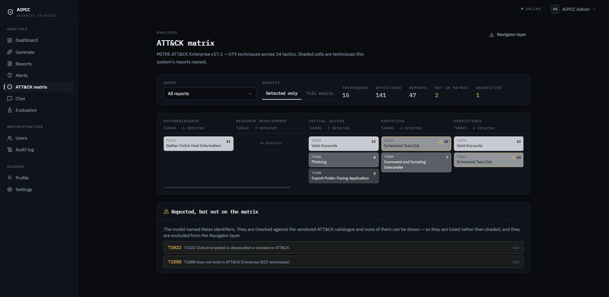
*15 techniques over 141 detections from 47 reports. The panel below the grid is the point: `T1022` is **deprecated or revoked in ATT&CK**, and `T1888` **does not exist in ATT&CK Enterprise (823 techniques)**. There is no column to draw them in, so they are named and counted rather than silently discarded — and they are excluded from the exported Navigator layer.*

A model that names a technique wrong fails in two different ways, so it gets two
different treatments:

- **Real id, wrong name → the cell is drawn, and marked `unverified`.** The
  detection happened; the model's description of it did not survive the check.
  The cell carries **the catalogue's** name, never the model's — rendering the
  model's wording onto a matrix cell would print the fabrication as a label.
- **Non-existent, malformed, or retired → no cell at all, and reported beside
  the grid.** Inventing a placement would be the same fabrication, in our UI.

Neither is ever dropped. Dropping either would make the matrix look cleaner than
the output behind it.

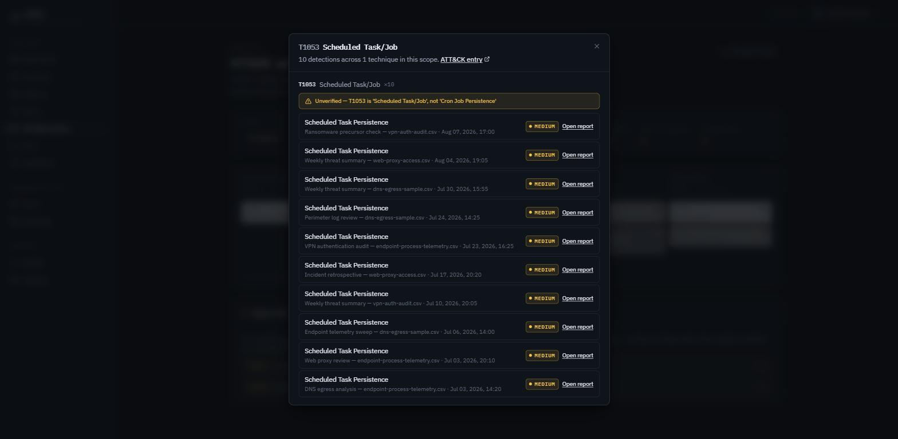
*Clicking an amber cell states the mismatch in the validator's own words. The model called `T1053` "Cron Job Persistence"; the catalogue says it is "Scheduled Task/Job". The ten detections behind the cell are still listed and still traceable back to the reports that produced them — the finding is not thrown away, its label is corrected.*

<details>
<summary>Grid legibility, the Navigator export, and two smaller decisions</summary>

**Sub-techniques do not get their own cells.** 679 placed techniques collapse to
211 parents across 245 cells, so the whole grid needs no virtualisation at all
and no new dependency — it is CSS grid and buttons. A detection on
`T1059.001` shades the `T1059` cell, and the cell says how many sub-techniques
sit behind it.

**All fourteen columns are always drawn, including empty ones.** The
recognisable thing about this diagram is its shape; hiding quiet tactics redraws
it per report and loses the "nothing was seen here" reading, which on a security
page is information. An empty column says *No detections* rather than being an
empty box.

**Frequency is an ink ramp, not a hue.** A darker cell already says "more", and
spending a colour on volume would dilute every colour that means something. The
only chroma on the grid is amber, and it means exactly one thing: this
identifier did not verify.

**The Navigator layer export** validates against a JSON Schema derived from
MITRE's published layer-format spec. No entry pins a detection to a tactic —
a finding says a technique was observed, not under which tactic, and Navigator
reads a missing `tactic` as "annotate every column this technique appears in",
which is exactly what is known. Unplaceable ids are absent from `techniques` but
named in the layer's `description` and counted in its `metadata`; a file that
simply omitted them would read as a clean run. **Not verified:** the layer has
not been opened in the live ATT&CK Navigator, so what is proven is conformance
to the published format, not the round trip through MITRE's app.

**The `--demo` seed contains three deliberately defective identifiers** — one
real-id/wrong-name, one invented, one revoked. Without them a demo database
renders fourteen clean detections and the part of this page that matters, *how a
bad identifier is handled*, has no data and looks like a feature nobody built.
Same argument as committing the weak model's cassette.

</details>

---

## Attack graph

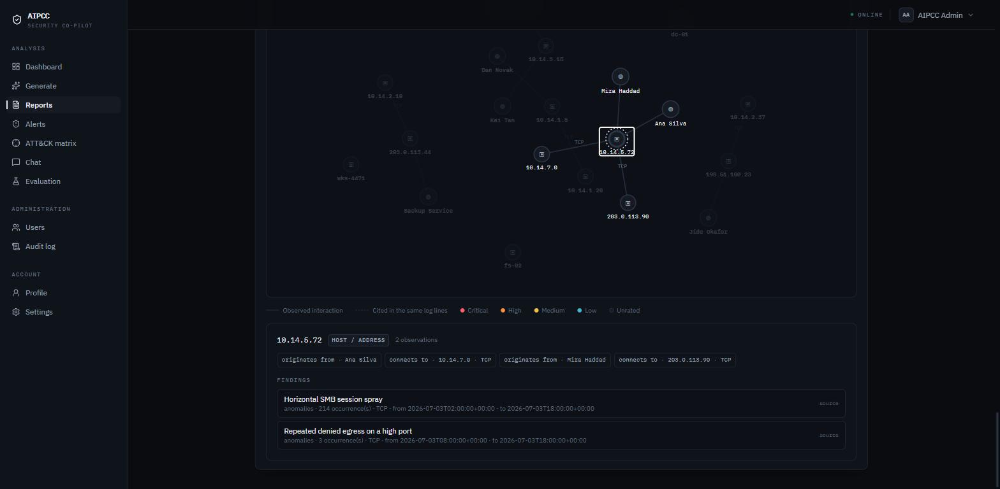
*20 entities and 12 relationships from one report. Selecting `10.14.5.72` dims the rest and shows what is actually known about it: **HOST / ADDRESS · 2 observations**, its edges (`originates from · Ana Silva`, `connects to · 10.14.7.0 · TCP`), and the two findings that touch it — each labelled with **why** it is attached. The legend distinguishes an observed interaction from "cited in the same log lines", because those are different strengths of claim.*

Nodes come from typed columns already stored — anomaly `user_id` / `user_name` /
`source_ip` / `destination_ip` / `protocol`, timeline `entity` — and edges from
those same rows plus the citations recorded at generation. **There is no second
extraction pass.** Asking a model to extract entities would produce a second set
of claims needing a second validator, and the shape of this whole project is that
model output is checked before it is believed.

### Identity: `j.doe` is not `jdoe`

Normalisation is case, whitespace and *surrounding* punctuation. Nothing else.
`JDOE`, `jdoe ` and `"jdoe"` are one node; **`j.doe` and `jdoe` are not**, and
neither are `jdoe@corp.com` and `jdoe@partner.com`.

Every additional rule that looks obvious — strip dots, strip a domain, strip a
`CORP\` prefix — is a way to merge two people who are not the same person. **A
duplicate node is recoverable by a human reading the graph; a fabricated identity
is not, because it looks exactly like a real one.** In a security tool,
over-merging is the worse error by a wide margin: it draws a relationship that
was never observed, between principals who were never the same, and it draws it
as confidently as everything else on the canvas.

Two identifiers merge **only** when a log row says they are one principal *and*
the pairing is unambiguous across the whole report. An anomaly carrying
`user_id=4471` and `user_name=rlee` is the schema asserting it. The first version
of this module unioned transitively, and the first run against real data produced
a node called `application` carrying the aliases `20`, `21`, `37` and `system` —
a generic display name had welded four principals into one actor touching four
hosts. A name seen against several ids now merges nothing, and there is a
regression test named after it.

<details>
<summary>Edges, risk attribution, and the legibility cap</summary>

**An anomaly row asserts exactly what it contains**: user → source, source →
destination labelled with the protocol, and user → destination *only* when there
is no source to route through — otherwise the graph would claim a direct
relationship the row does not describe.

**Shared citations connect what no column relates.** Two findings citing the same
chunk were read out of the same log rows; that is how a timeline entity, which
has no address and no user column, joins the graph at all. It is a weaker claim,
so it is drawn dashed and pulls less hard in the layout. A chunk naming more than
six entities creates no edges — a widely-shared retrieval hit is not evidence of
a specific relationship, and without the cap the graph becomes a clique.

**Node type is allowed to be a guess; node identity never is.** Deciding that
`vpn-gw-01` is a host puts the wrong icon on a correct node; deciding two names
are one person puts a false relationship on the canvas. That asymmetry is why
classification uses shape heuristics freely and normalisation uses none.

**Risk is inherited, and the route is recorded.** Anomalies and timeline events
carry no severity column, so a node's risk comes from findings that do — either
`evidence` (a finding cites a chunk this node's own finding also cites) or
`mention` (the node's label appears verbatim in the finding's text). Those are
different strengths of claim and the UI says which one you are looking at. A
mention must match a whole identifier: `10.0.0.7` is not named by a finding that
says `10.0.0.76`, and a plain substring test would attach a critical severity to
the wrong host in a way that looks entirely plausible.

**Capped at 60 nodes, ranked by risk then degree, and the cap is stated on
screen.** A graph that silently drops nodes to stay readable lies about the
report it claims to describe. `n/a`, `none`, `unknown` and `-` are not entities —
they are the model writing "absent", and one of them had become a user node with
its own edges before that was caught.

The renderer is `d3-force` and nothing else — the simulation only, drawn as SVG
by our own component, behind a lazy boundary. The whole chunk is **17.47 kB raw
/ 6.88 kB gzipped**. `react-force-graph` pulls in three.js; `cytoscape` and
`vis-network` are 300–400 kB and arrive with a complete visual language this app
would then have to override.

</details>

---

## Authentication, authorization and the audit trail

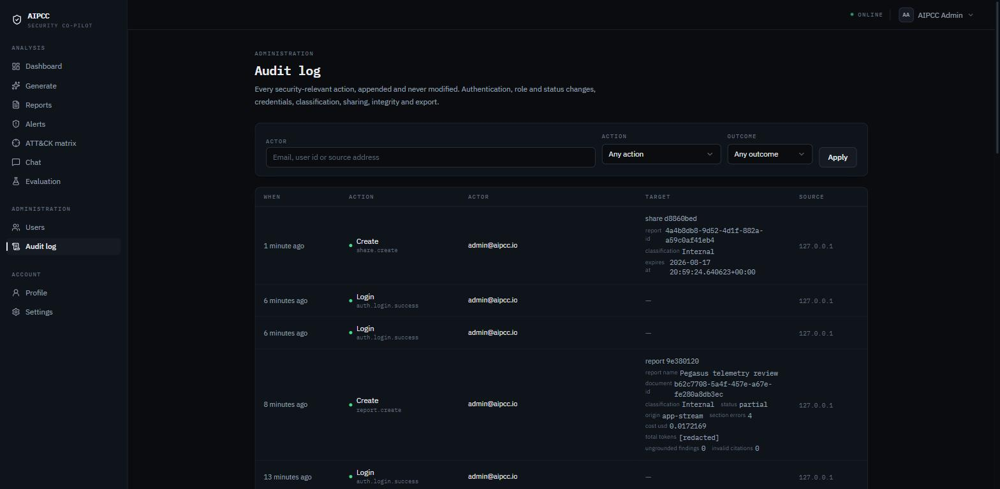
*Every security-relevant action, appended and never modified. Note the `report.create` row: origin `app-stream`, `section errors 4`, `cost usd 0.0172169`, `ungrounded findings 0` — and `total tokens [redacted]`, because redaction is enforced by key name at write time rather than trusted to the caller.*

- **OAuth2 password flow, bcrypt, JWT** for humans. `get_current_user` is the
  only way a route learns who is calling — there is no module-level user, and a
  test fails the build if one appears.
- **Ownership violations return 404, not 403.** A 403 confirms the id is real to
  someone who should not know that.
- **Login is constant-shaped**: identical error text for unknown email and wrong
  password, and a dummy bcrypt verification on the unknown-email path so latency
  does not distinguish the two.
- **`/auth/register` always creates an analyst.** A `role` in the body is
  ignored, never honoured.
- **A report belongs to the owner of the document it analyses, not to the
  caller.** Found while testing the n8n service key end to end: attributing to
  the caller filed every workflow-generated report under `n8n@aipcc.io`, where
  the analyst whose log it described could never see it.

### Machine credentials, and what a leaked one can do

Access tokens expire in 60 minutes, which cannot work for a scheduled workflow;
raising that lifetime would weaken every human session to suit a machine. So n8n
gets a **revocable API key** presented in the same `Authorization: Bearer`
header, told apart by an `aipcc_` prefix a JWT can never have.

**`require_human` refuses API keys on `/users` and `/api-keys`.** A key lives in
a credential store and is long-lived by design; if one leaks it must not be able
to mint a second credential or create an admin. It can do the workflow's job and
nothing beyond it. That containment is what makes an admin-role service account
acceptable at all — and the FIM engine needs admin, because `/get_all_reports` is
owner-scoped. The service account has no login path: its password hash is a
random value nobody holds.

<details>
<summary>Brute-force protection — two controls, because there are two attacks</summary>

**Per source address: a hard lockout.** Five failures in fifteen minutes and that
address gets 429 until the oldest ages out. This is the control that stops a
flood.

**Per account: a progressive delay, and never a lock.** The textbook per-account
lockout is a trap — it hands anyone a one-request denial of service against any
address they can guess, trading one vulnerability for another. So the account
side sleeps (2s, 4s, 8s, capped) and stays answerable to whoever knows the
password. It exists for the *distributed* spray, where every request comes from a
fresh address and the per-IP counter never fills. The cap is not cosmetic: each
delayed login holds a threadpool thread, so an unbounded backoff would be a
denial of service inflicted on ourselves.

The delay applies to unknown addresses too, keyed on whatever was typed. Skipping
it when the account does not exist would make the delay itself an enumeration
oracle — fast means "no such user", slow means "that one is real". A successful
login does not refund the IP budget, or an attacker holding one valid account
could reset their spray allowance at will.

**`X-Forwarded-For` is ignored unless `TRUST_PROXY_HEADER` is set.** It is
caller-supplied: trusting it with no proxy guaranteed to overwrite it keys the
lockout on a string the attacker chooses — no lockout at all — and
simultaneously lets anyone lock out someone else's address by claiming it.

Verified live against a running server: 401 at ~510 ms for the first three
attempts, 2.5 s on the fourth, 4.5 s on the fifth, and `429` with
`Retry-After: 891` on the sixth — all of it landing in the audit view.

</details>

<details>
<summary>Append-only, enforced twice — and the two tests that passed on a bug</summary>

No endpoint updates or deletes an audit row, *and* a Postgres trigger raises on
UPDATE, DELETE and TRUNCATE. The trigger is the one that still holds after
somebody adds a well-meaning "clean up old entries" endpoint. TRUNCATE needs its
own statement-level trigger — it never fires a row-level one, so without it
"append-only" is one `TRUNCATE audit_log` away from false.

**`actor_id` deliberately has no foreign key.** Every other actor reference in
this schema cascades on delete, which is right for data a user owns and
catastrophic here: deleting a user would erase the record of what that user did,
the single most interesting case the log exists for.

**A failed login is never attributed to the account as its actor.** Nobody proved
they were that user; that is what "failed" means. The account is the *target*,
the attempted address is `actor_label`, and `actor_type` is `anonymous`. Found by
reading the rendered page, where "admin@aipcc.io — Login failure" was
indistinguishable from something the admin had actually done.

**Two audit tests passed on a bug.** The obvious assertion — do the request, then
query — cannot detect a missing commit: the test session *is* the route's
session, and an intervening query autoflushes the uncommitted row into the same
transaction. Confirmed by deleting the commit and watching them still pass. A
`db.rollback()` after the request is what closes the gap, and both tests now fail
without their commit.

**`POST /auth/logout` does not invalidate anything, and says so.** Access tokens
are stateless JWTs; revoking one needs a jti deny-list checked on every request —
a real feature with a real cost, not something to imply with an endpoint that
returns 204. It exists for the audit line.

</details>

---

## Export, classification and share links

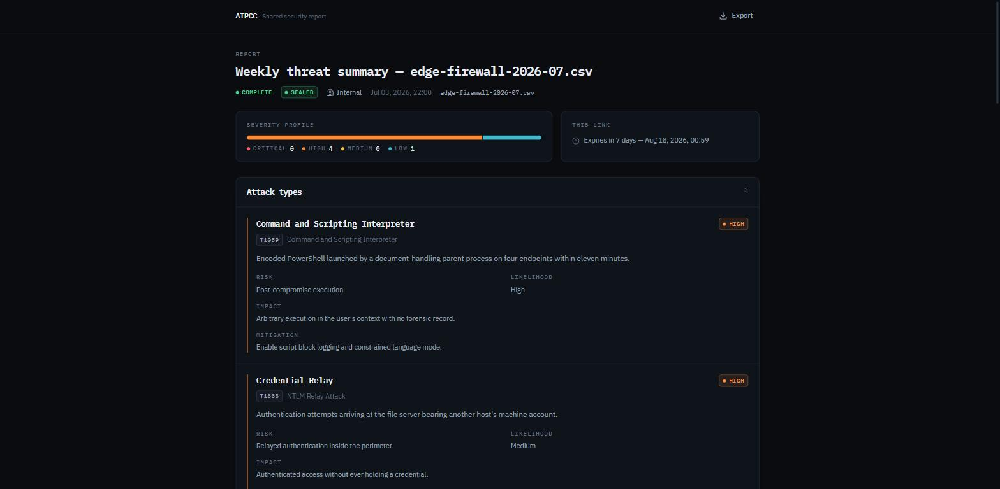
*What a link holder sees. `/share/:token` sits outside both the auth guard and the app shell — not a styling choice: the shell exists to move between a user's reports, and there is nothing here for a link holder to move to. Note also what is **missing**: no "Ungrounded" markers and no evidence excerpts, because a share grants read of a report, not of the source log.*

**A share token is a capability, not a credential.** It never reaches
`get_current_user`; it is read only from the path, and the routes that accept it
read exactly one row. A JWT for the owning user would mean a link forwarded to a
contractor carries the whole account. It deliberately does not reuse the API-key
module either — merging them would put the capability into the `Authorization`
header, one `looks_like_*` bug away from being treated as an identity.

**Three refusals, three status codes, on purpose.** Unknown *and revoked* → 404
with an identical body, because revocation usually answers a leak and must not
confirm to whoever leaked it that they held something real. Expired → 410 with
the date, because that holder was given the link legitimately and needs "ask for
a new one", not "the app is broken". Classification → 403, a policy answer. Each
gets its own page in the UI.

**Classification is re-read on every open**, not only at creation. The link
holder never loads the UI that would hide a button, so anything checked only at
creation time is not enforced at all. Raising a report to Confidential kills its
links immediately; lowering it restores them, because revoking on write would
silently destroy links a mistake could otherwise undo.

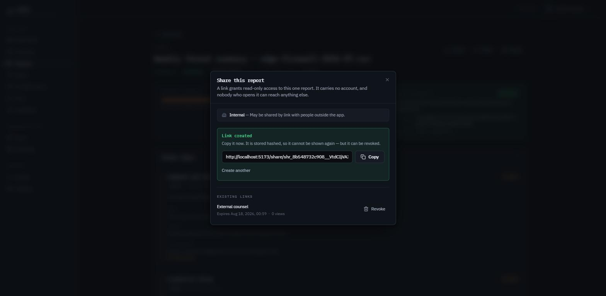
*Creating a link. The token is shown exactly once and only its hash is stored — and the existing-links list underneath reads `active` from the server rather than recomputing it from `expires_at`, so the dialog and the link itself cannot disagree for anyone whose machine clock is off. (This link was revoked immediately after the screenshot.)*

<details>
<summary>PDF and DOCX from one document model</summary>

`services/export/layout.py` turns a report into headings, labelled paragraphs and
table rows; `pdf_writer` and `docx_writer` walk that and **never read a report
field**. So the PDF and the DOCX cannot disagree about content — only about
typography — and a new report field is added in one place instead of two.

Narrative sections become findings; enumerative sections become tables. A
six-column table of paragraphs is unreadable on paper at any width. Null fields
are dropped from a finding and dashed in a table: on screen a `—` sits in a dense
grid and reads as "nothing here", but printed as its own labelled paragraph it
reads as a defect.

`python-docx` and `reportlab`, both pure-Python wheels. WeasyPrint would let the
export reuse the app's CSS but needs GTK on the host, which breaks "clone and
`docker compose up`" for the sake of a nicer box model.

Model output is escaped in both writers — ReportLab treats a `Paragraph` as
markup and DOCX is XML, so an LLM emitting `<b>` or `&` is a rendering failure in
one and an injection in the other.

**Bug found live:** `Content-Disposition` is not a CORS-safelisted response
header. The export downloaded correctly, the header was sent, and the browser hid
it from JavaScript — so every file silently saved under the client's fallback
name. Nothing failed, which is exactly why it now has a test.

</details>

---

## n8n automation

Three workflows, all executed inside n8n against a running backend with a real
service key and live Groq / AbuseIPDB / VirusTotal credentials — the screenshots
below are those runs, not dry ones. Import instructions and the full contract for
every endpoint they call are in [`n8n/IMPORT.md`](n8n/IMPORT.md).

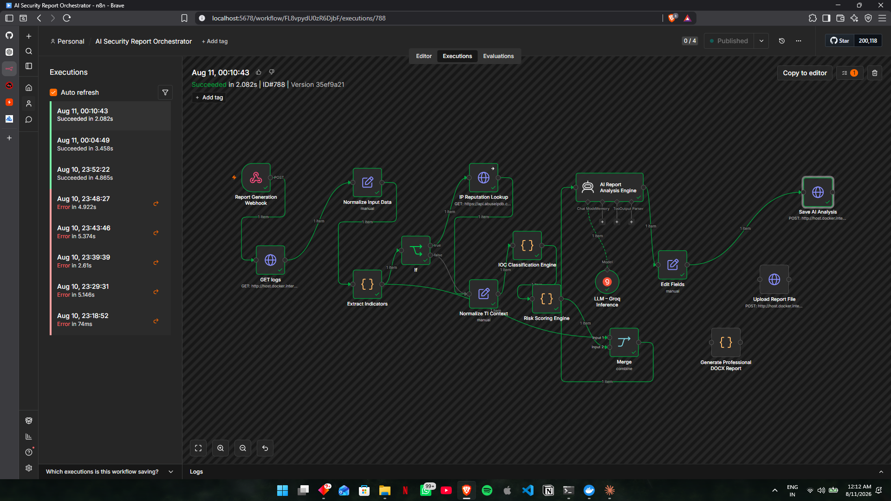
*The **AI Security Report Orchestrator** (16 nodes) completing end to end in 2.082 s: webhook → fetch logs → Groq agent → risk scoring → IOC classification → AbuseIPDB reputation → threat-intel merge → DOCX → store. Every node green, not a dry run.*

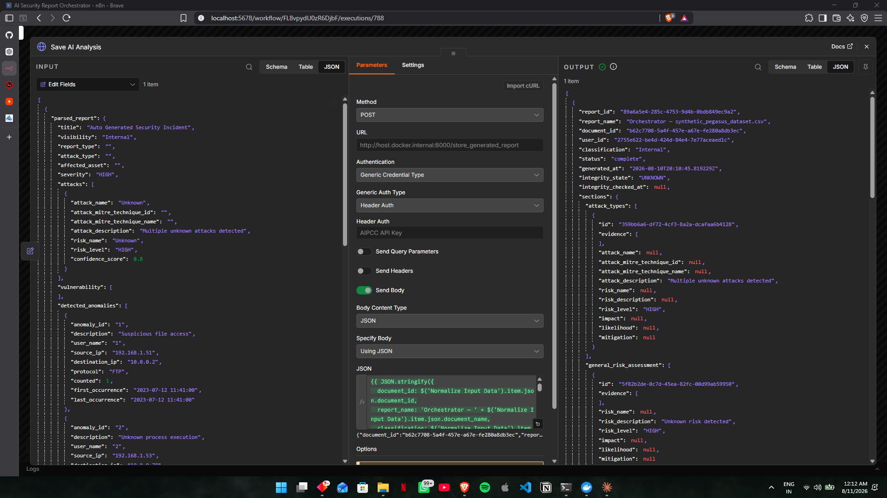
*The store node, input on the left and the backend's response on the right. This is the seam where n8n stops being authoritative: `/store_generated_report` re-validates the sections against the same Pydantic schema the in-app generator uses before anything is written. The exported workflow originally sent `report_json`, `user_id` and `generated_filename`, none of which exist on that endpoint — `user_id` is gone and is not coming back, because a body field naming the owner would be a hard-rule violation wearing a disguise.*

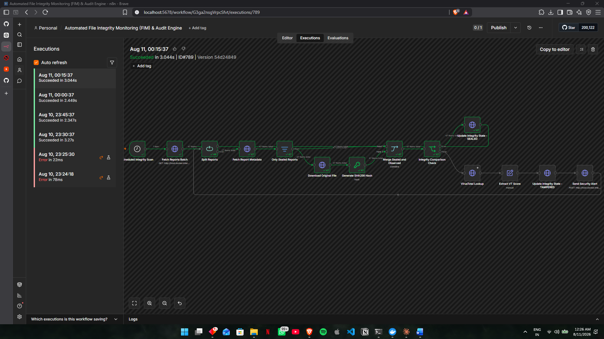
*The **FIM & Audit Engine** (14 nodes) sweeping **47 reports**: fetch → skip unsealed → download by id → SHA-256 → compare against the hash sealed at generation time → SEALED, or VirusTotal lookup → TAMPERED plus a security alert. A report with a null `file_hash` is filtered out rather than failed — comparing against a null hash would mark every unsealable report TAMPERED, which is a false accusation, not a finding.*

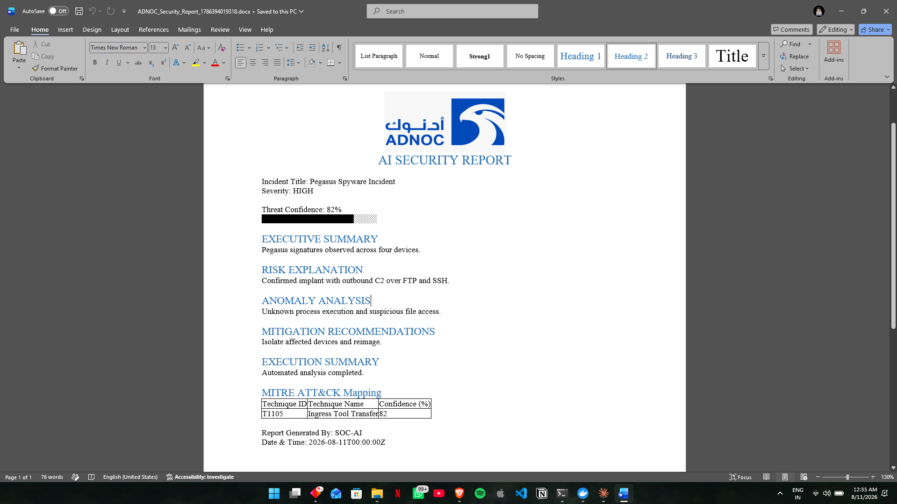
*The **Simple Report Generator** (3 nodes) output: a real .docx produced by the workflow and opened in Word, with an embedded letterhead image and the MITRE mapping as a table. Self-contained — it calls no backend endpoint, and is kept as a reference implementation now that export lives in the backend.*

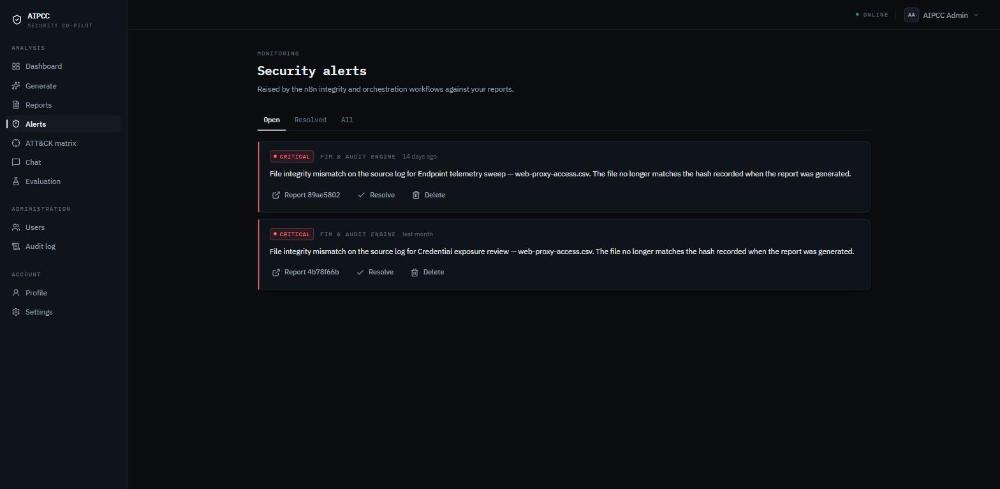
*The alerts those workflows raise, in the app. Both are file-integrity mismatches attributed to **the owner of the report they concern**, not to the service account that posted them — so they reach the analyst rather than a machine's inbox. Severity is normalised on the way in and never rejected: losing an alert because its severity was spelled oddly is worse than filing it one notch off.*

<details>
<summary>What the exported FIM graph got wrong, and path safety</summary>

The graph as exported could not have worked even with auth attached. It read
`$json.report[0].document_name` against an API that returns a **flat** report
object, so every downstream expression referenced a shape the API never had. It
had two nodes fetching the same file and merged one of them with a hash of the
other. And it ran **every minute** — re-hashing every document in the system
sixty times an hour is not monitoring, it is a load test. It now downloads once,
by id, and runs every 15 minutes.

**A caller-supplied file name is a database key, never a path.**
`GET /uploads/{document_name}` resolves the name against the `documents` table
and serves *that row's* stored path; `settings.upload_dir / name` would happily
open `../../.env`. The stored path is then still checked to resolve inside the
upload directory, because a row written by older code is untrusted input too.

Both download routes return **410**, not 404, when the record exists and the
bytes are gone. Those are different problems and the FIM engine handles them
differently.

A committed test fails the build if any workflow JSON carries an embedded
credential — `tests/test_foundation.py::TestNoEmbeddedCredentials`, including a
test that the detector itself still fires and one that ordinary n8n expressions
and URLs are not flagged.

</details>

---

## Observability and cost

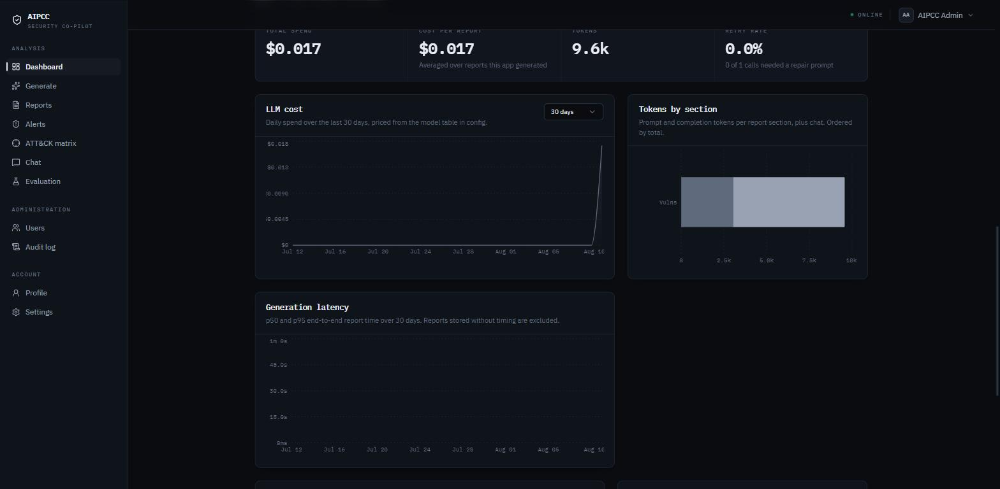
*Per-call token and cost accounting, captured at the provider seam. `RETRY RATE 0.0% — 0 of 1 calls needed a repair prompt` is a real ratio over real calls, not a static label. Spend gets no hue: it is neither a severity nor a state, and a taller area already says "more".*

- **A correlation id on every response header, every log line and every audit
  row.** An inbound `X-Request-ID` is untrusted input — it is echoed in a header
  and written into log records, so a newline in it forges a log line and a CR
  forges a header. It is filtered to `[A-Za-z0-9_-]`, truncated to 64, and
  replaced entirely if nothing survives.
- **Structured JSON logging**, replacing uvicorn's access log rather than joining
  it. The access line logs the route *template*, never the resolved path:
  `/reports/{report_id}` is one log key, the resolved path is one per report,
  which makes the log unaggregatable and puts identifiers into it for no benefit.
- **OpenTelemetry spans** across HTTP, SQL, retrieval and each LLM call — the
  four places a report generation spends time. Off by default, because the
  console exporter prints a multi-line dump per span and would make
  `docker compose up` a wall of JSON. `docker compose --profile tracing up` puts
  Jaeger on :16686. **No prompt, completion or document content is on any span**;
  traces ship to a collector, and log data does not leave this system that way.
- **Unknown cost is `null`, never `0` — three times over.** A provider that
  reports no usage gives null tokens; a model absent from the price table gives a
  null cost; a report with no usage rows gets null totals. Zero would put "this
  was free" and "nobody measured it" in the same bucket, quietly drag every
  aggregate down, and leave a figure that still looks plausible. `unpriced_calls`
  is surfaced on the dashboard, because a total that silently excludes calls
  nobody could price reads as complete when it is not.
- **`generation_ms` is wall-clock, not the sum of section latencies.** The
  sections run concurrently; summing them reports about five times the truth
  (measured once: 94 ms elapsed against 459 ms summed). p95 is computed with
  `percentile_cont` in Postgres, because a mean over five concurrent sections
  hides the one slow section that decided how long the analyst actually waited.
- **Usage is recorded before the response is judged.** A call that produced
  unusable JSON still spent its tokens, and a cost that counted only successful
  calls would understate exactly the reports that went wrong most expensively. A
  provider *outage* records nothing — that call never reached the model, and
  inventing zeros for it would drag every average down.

---

## Tech stack

Only what `requirements.txt` and `package.json` actually install.

| | |
|---|---|
| **Backend** | Python 3.11+, FastAPI, SQLAlchemy 2.x, Alembic, Pydantic v2 + pydantic-settings, uvicorn |
| **Database** | PostgreSQL 16 — 18 tables on UUID keys, 8 migrations |
| **RAG** | Chroma, `sentence-transformers/all-MiniLM-L6-v2`, `langchain-text-splitters`, pandas |
| **LLM** | Provider abstraction over `langchain-google-genai` (Gemini, default), `langchain-ollama` (local), `langchain-groq`. Imports are deferred to the point of use, so an unset key is a config error rather than an `ImportError` at boot. |
| **Auth** | `bcrypt`, `PyJWT`, `email-validator` |
| **Export** | `python-docx`, `reportlab` — both pure-Python wheels, no system libraries |
| **Observability** | `opentelemetry-sdk` + FastAPI/SQLAlchemy instrumentation + OTLP HTTP exporter |
| **Frontend** | React 19, Vite 6, react-router-dom 7, TanStack Query 5, Tailwind 4, Radix primitives, Recharts, `d3-force`, `lucide-react`, axios |
| **Fonts** | IBM Plex Mono + Sans, self-hosted via `@fontsource` — no CDN, works offline |
| **Automation** | n8n (Groq, AbuseIPDB, VirusTotal) |
| **Tests** | pytest + httpx + jsonschema; Vitest + Testing Library + jsdom; `ruff` and `eslint` |

`langchain-core` is deliberately absent: nothing imports it, and all three
providers pin a compatible version themselves.

<details>
<summary>Frontend bundle, measured on the committed build</summary>

```
dist/assets/index-*.js         662.37 kB │ gzip: 203.52 kB
dist/assets/ChartGrid-*.js     410.73 kB │ gzip: 118.63 kB   (lazy)
dist/assets/GraphCanvas-*.js    17.47 kB │ gzip:   6.88 kB   (lazy)
dist/assets/index-*.css         65.81 kB │ gzip:  11.92 kB
```

Recharts is behind `React.lazy` because `/dashboard` is the landing route, and
importing it eagerly put the whole charting library in front of the first paint.
`components/charts/ChartGrid.jsx` is the lazy boundary and **nothing else may
import `recharts` directly**, or the chunk merges back into the entry bundle —
which is why there is deliberately no barrel file in that directory. `d3-force`
has the same rule and its own boundary.

</details>

<details>
<summary>Two frontend conventions that were bugs first</summary>

**Never build a class name at runtime.** Tailwind generates utilities by scanning
source *text*, so a class produced by concatenation or `.replace()` silently
never gets a rule. This was live: `border-critical/60` was assembled with
`.replace("/35", "/60")` and every severity rule rendered in the default border
colour. Severity classes are now written out in full in `lib/format.js`.

**Do not name a theme colour `canvas`.** It collides with the CSS system-colour
keyword, and Tailwind silently emits no utility and no variable for it. The base
surface token is `--color-void`.

</details>

---

## Testing and CI

**616 backend tests and 66 frontend tests**, plus the evaluation gate. `ruff
check` and `npm run lint` are both clean with no warnings.

```
tests/test_hardening.py     59   brute force, headers, audit trail, redaction
tests/test_integrations.py  54   API keys, require_human, FIM endpoints, alerts
tests/test_eval.py          51   catalogues, metrics, replay, the gate itself
tests/test_report.py        49   schema alignment, validation, repair retry
tests/test_observability.py 48   correlation, logging, tracing, cost accounting
tests/test_share.py         47   capability tokens, expiry, classification
tests/test_attack_graph.py  45   identity, edges, risk attribution, the cap
tests/test_auth.py          42   ownership scoping, constant-shaped login
tests/test_export.py        40   layout model, PDF and DOCX writers
tests/test_grounding.py     40   chunk identity, provenance, citation validation
tests/test_dashboard.py     34   SQL aggregation, severity buckets, empty days
tests/test_attack_matrix.py 31   placement, unverified cells, Navigator layer
tests/test_chat.py          28   retrieval scoping, persistence, provider failure
tests/test_api.py           18   documents, reports, the n8n store path
tests/test_foundation.py    16   the hard-rule guards
tests/test_streaming.py     14   SSE frames, reservation, reconnect
```

The guards are the ones worth naming, because they are what stops the prototype's
defects from coming back by accident:

- `test_no_schema_creation_in_app_code` — no `drop_all`/`create_all` anywhere.
  The prototype wiped its database on every boot.
- `test_no_module_level_current_user` — a hardcoded caller fails the build.
- `test_password_hash_always_comes_from_hash_password` — no path writes a
  password any other way.
- `test_env_is_read_only_in_config` — no bare `os.getenv` outside `config.py`.
- `test_every_schema_field_is_a_column` and `test_storage_uses_no_literal_field_names`
  — the schema/column drift that made the prototype's reports save mostly null.
- `test_committed_workflows_carry_no_secrets` — plus a test that the detector
  itself still fires, and one that ordinary n8n expressions are not flagged.

The scanner masks comments and string literals before matching, so it tests code
rather than prose.

**CI runs four jobs from a clean checkout** with none of this machine's state
(`.github/workflows/ci.yml`): backend lint + migrations + pytest against a
Postgres service container; the eval gate with no database and no network;
frontend lint + tests + build with `npm ci`; and `docker compose config` plus a
frontend image build.

<details>
<summary>What CI deliberately does not do, stated rather than skipped</summary>

**The backend image is not built in CI.** It installs torch and bakes in the
embedding model — 3.35 GB — which exceeds what a standard runner holds alongside
its preinstalled toolchain. The same `requirements.txt` is installed from scratch
in the backend job, so what is left unproven is the Dockerfile alone.

**`ruff format` is not enforced.** The formatter would rewrap every docstring and
comment in this codebase, and the comments carry most of the reasoning — a
reformat that turns a paragraph explaining a bug into differently-wrapped lines is
a large diff that hides real ones. `B008` is not switched off either:
`extend-immutable-calls` names FastAPI's `Depends` and friends, so the check keeps
working on a real `def f(x=[])`.

Frontend tests were chosen for what breaks *silently*: the 401 interceptor
including its carve-out (a 401 from `/auth/login` is a wrong password, not a dead
session, and getting that backwards logs you out of a session you never had);
`ProtectedRoute`'s third state, where a stored token mid-exchange reads as
unauthenticated for one render and bounces the user to /login and back on every
reload; and the four states of a list view, because "empty is not the same as
failed" erodes silently in development where the API is always up.

</details>

---

## What this does not do

Stated plainly, because a README that admits its limits is worth more than one
that doesn't.

- **It does not evaluate retrieval.** Golden retrieval is a fixed selection over
  five chunks, so a change that made the retriever pick worse chunks would not
  move a single published number. Evaluating retrieval needs a larger corpus with
  relevance judgements. That is future work, not something quietly implied.
- **The golden set is one synthetic 35-row CSV** with a deliberately unambiguous
  story. Nothing here speaks to noisy production data, to log formats other than
  CSV, or to attacks not represented in that file.
- **The CI gate says nothing about the current model.** It replays responses
  frozen at the moment they were recorded. Only `--live` produces numbers that
  describe a model.
- **CVE existence is not verified**, only CVE *format*. The list is unbounded and
  checking it needs a network call.
- **The ATT&CK Navigator layer has not been opened in the live Navigator.** What
  is proven is conformance to the published layer format, validated against a
  schema derived from MITRE's spec — not the round trip through MITRE's app.
- **`POST /auth/logout` does not invalidate the token**, and the endpoint says so
  rather than implying otherwise.
- **This is a portfolio project, not a deployed product.** It has not run against
  a real SIEM, it has no multi-tenancy, and the rate-limit state in Postgres
  would be the wrong choice for a per-request API limiter (it costs one write and
  one indexed count per authentication attempt, and has no automatic expiry —
  `python -m app.db.prune` is the answer, and nothing runs it for you).

The prototype's README claimed local Ollama execution and AES-256 encryption that
the code never implemented. Not repeating that is most of the point of this
section.

---

## Credits

Rebuilt from [`ahmed2bassam/AIPCC`](https://github.com/ahmed2bassam/AIPCC), a
university group project with 7 contributors. That prototype proved the RAG +
structured-report concept; the RAG pipeline and the five section prompts were
ported from it and are credited in [`PORTING.md`](PORTING.md). Everything else in
this repository is a ground-up reimplementation.

MITRE ATT&CK® and CWE™ are © The MITRE Corporation, used under their respective
terms of use; the ATT&CK Navigator is Apache-2.0. Versions, source URLs, download
checksums and attributions for every vendored file are recorded in
[`backend/app/eval/data/SOURCES.md`](backend/app/eval/data/SOURCES.md).

Licensed under the [MIT License](LICENSE).
